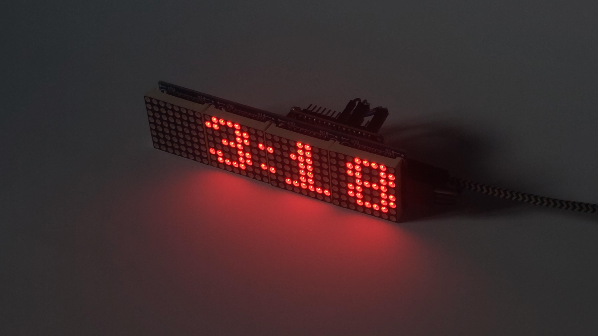

# SleepWise
A clock that counts down until your bedtime, reminding you of the little time left.


# What's this? 
This is a simple project of mine where I plugged a MAX7219 to an ESP8266 NodeMCU that has MicroPython on it. The [main.py](main.py) file should be edited to customize the counter to your needs. I have implemented [aiorepl](https://github.com/micropython/micropython-lib/blob/master/micropython/aiorepl/README.md) into the library for debugging. Sometimes it works, sometimes it does not. The script uses Central European Time.

# How to use
1. Buy the necessary hardware.
2. Flash MicroPython onto your ESP8266.
3. Install [mpremote](https://docs.micropython.org/en/latest/reference/mpremote.html) for REPL access and file operations.
4. Clone my repository, edit `main.py` to fit your needs and transfer **all the python files** with `mpremote cp main.py :`.
5. Modify `boot.py` in the micropython root to include something like this:
```python
try:
    import main
except Exception as e:
    print(f"Error in main.py: {e}")
    print("Entering safe mode - REPL remains accessible") # This way REPL doesn't lock up.
```

# Acknowledgements
Special thanks to:
- The [MicroPython team](https://github.com/micropython/micropython), sparing me from having to learn C.
- [enchant97](https://github.com/enchant97/micropython-max7219) for the Max7219 library.
- JumpZero for making the [CET time script](https://forum.micropython.org/viewtopic.php?f=2&t=4034).
